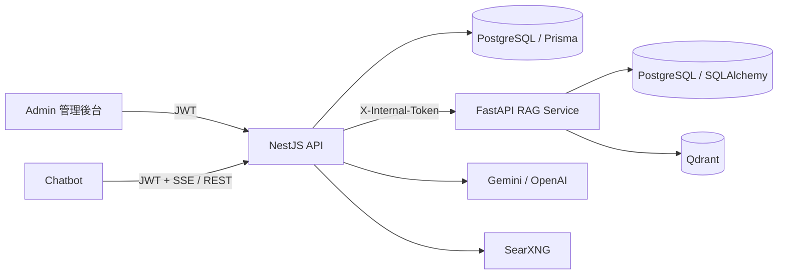

# 管理後台功能機制說明

## TL;DR

- 本文件說明「資料來源、標籤範本、報告模板、Demo 問題庫、測試執行、系統設定」目前實際如何運作，不是完成功能評分表。
- 六項功能都已有管理後台入口與受保護的 API；實際作用範圍依各模組目前已接通的資料流而不同。
- 重要使用邊界包含：Google Drive 同步尚有憑證解密問題、標籤陣列尚未套用到上傳資料、報告匯出尚未開放於 Chatbot 畫面，以及 Golden Test 會建立正式對話資料。

## 文件目的

管理者需要知道每個設定會影響哪一段系統流程、資料存在哪裡，以及使用時會看到什麼結果。本文件以 2026-07-11 的程式、唯讀 API、資料庫狀態與既有測試為依據；只描述已接通或可由程式確認的機制，未接通部分列為「目前使用邊界」。

資料清理、審查、管理者帳號與稽核功能不在本次六項功能的調整範圍內，既有機制維持不變。

## 共通架構與權限

| 共通項目 | 目前機制 |
|---|---|
| 後台登入 | Admin 前端登入後保存 Access Token；還原登入狀態或登入時若角色不是 `admin`，不允許進入後台頁面。 |
| API 保護 | 六項功能的管理 API 都套用 JWT 與角色守門；未登入呼叫會得到 `401 Unauthorized`。 |
| 服務間認證 | NestJS 轉送至 FastAPI 的資料來源與標籤範本 API 使用 `X-Internal-Token`，不直接暴露 FastAPI 給後台瀏覽器。 |
| 稽核 | Google Drive、標籤範本與聊天額度的管理操作有稽核攔截或明確稽核欄位；網路搜尋設定目前未套用同一個稽核攔截器。 |
| 畫面狀態 | Admin 頁面透過 REST API 載入資料，成功後更新列表或設定；錯誤以訊息提示，不會在前端自行假定儲存成功。 |

## 資料來源

資料來源頁目前管理 Google Drive 資料夾連線，目標是把支援的檔案同步、切塊後送入 RAG 向量庫。

| 項目 | 目前機制 |
|---|---|
| 後台入口 | `/datasources` |
| 管理操作 | 建立或更新連線、上傳 Service Account JSON、設定排程與切塊選項、手動同步、檢視狀態／檔案／歷程、解除連線。 |
| API 路徑 | Admin → NestJS `/api/datasources/gdrive/*` → FastAPI `/api/v1/gdrive/*`。 |
| 資料儲存 | `gdrive_configs`、`gdrive_sync_files`、`gdrive_sync_history`；文件向量進入 Qdrant。 |
| 權限 | 管理者專用；NestJS 代理操作套用稽核攔截器。 |
| 本機資料狀態 | 尚未設定連線，追蹤檔案與同步歷程皆為 0。 |

### 操作流程

1. 管理者輸入 Google Drive Folder ID、顯示名稱、排程、預設標籤及階層式切塊選項，並上傳 Service Account JSON。
2. FastAPI 先以該 Service Account 驗證目標資料夾可存取，通過後才加密憑證並儲存設定；回應不包含原始憑證。
3. 手動或排程同步會列出資料夾第一層的支援檔案，依 Google Drive 檔案 ID 與 checksum 判斷新增、修改、未變更或刪除。
4. 新增或修改的檔案會下載至暫存區，經文件解析、切塊與向量化後寫入 Qdrant；修改檔案會先替換舊來源內容。
5. Google Drive 已移除的檔案會從追蹤資料與向量庫移除；每次同步記錄成功、失敗、跳過、刪除數量及錯誤訊息。
6. 解除連線時可選擇保留既有 RAG 向量，或連同已同步的向量資料一併清除；兩種方式都會刪除連線設定及其追蹤、歷程資料。

支援格式為 PDF、DOCX、XLSX、PPTX、XLS、CSV、TXT、Markdown、HTML 與 JSON。排程模式包含手動、每小時、每日 02:00、每週一 02:00。

### 目前使用邊界

- 同步服務目前把資料庫中的加密 Service Account 內容直接交給 JSON 解析器，尚未在同步前解密。因此設定驗證與儲存機制可用，但實際同步在憑證讀取階段會失敗。
- 編輯既有連線且未重新上傳憑證時，Admin 會送出 `{}`；FastAPI 會重新驗證並覆寫憑證，所以「保留原憑證」目前尚未成立。
- 服務啟動只會啟動排程器，未從資料庫重新載入既有排程；排程需在目前服務程序中重新儲存設定後才會註冊。
- 同步只掃描指定資料夾第一層，不會遞迴讀取子資料夾。
- 解除連線並保留 RAG 向量時，連線、檔案追蹤與同步歷程仍會級聯刪除；留下的向量不再有此資料來源的追蹤對應，也無法從同一連線執行後續清除。

## 標籤範本

標籤範本用來預先保存法規／知識分類與附加資料，讓管理者在上傳清理檔案時快速帶入共同欄位。

| 項目 | 目前機制 |
|---|---|
| 後台入口 | `/tag-templates` |
| 管理操作 | 新增、編輯、刪除與分頁瀏覽範本。 |
| 範本欄位 | 名稱、說明、標籤陣列、法規／知識類型、主管機關、狀態。 |
| API 路徑 | Admin → NestJS `/api/v1/tag-templates` → FastAPI `/api/v1/tag-templates`。 |
| 資料儲存 | PostgreSQL `tag_templates`。 |
| 權限 | `admin` 可讀寫；`data_cleaner`、`data_reviewer` 可讀取。 |
| 本機資料狀態 | 目前沒有標籤範本資料。 |

### 操作流程

1. 管理者建立範本；名稱必填、最長 200 字且不可重複。
2. 列表依名稱排序，Admin 對已載入資料每頁顯示 20 筆。
3. 清理檔案上傳畫面的「法規／知識分類」會載入範本清單。
4. 選取範本後，畫面會帶入法規／知識類型、主管機關與狀態；未提供類型的範本仍須由管理者手動選擇。
5. 一批檔案共用一種類型；畫面逐檔更新，全部成功後才建立清洗任務。任一失敗會停在分類畫面供重試。
6. `general`、SOP、案例採一般知識處理；只有法律、子法、ISO、NIST、CIS 進入法規品質與版本治理。

### 目前使用邊界

- 範本中的 `tags` 可在後台儲存與顯示，但清理上傳的中繼資料結構目前沒有 `tags` 欄位；選取範本時不會把標籤陣列套用到檔案。
- `other` 僅供既有資料與 API 相容，不會出現在新建範本或新上傳選單。
- 刪除範本是實體刪除，只移除範本本身；不會回溯修改已套用到檔案的法規／知識類型、主管機關或狀態。
- Admin 載入列表時沒有傳分頁參數，FastAPI 預設只回傳前 100 筆；因此第 101 筆以後的範本目前不會出現在此頁。API 單次請求上限雖為 500 筆，Admin 尚未接續載入後續頁面。

## 報告模板

報告模板控制顧問報告 DOCX 的標題、字型與章節組成，實際產檔由 NestJS 報告產生服務負責。

| 項目 | 目前機制 |
|---|---|
| 後台入口 | `/report-templates` |
| 管理操作 | 新增、編輯、刪除、啟用或停用模板。 |
| 模板類型 | `consultation`、`iso27001_gap`、`policy_draft`。 |
| 版面選項 | 標題前綴、字型、執行摘要、諮詢紀錄、引用來源、免責聲明、自訂免責內容。 |
| API 路徑 | 管理 CRUD：`/api/report-templates`；產檔：`/api/chat/conversations/:id/export-report`。 |
| 資料儲存 | PostgreSQL `report_templates`。 |
| 權限 | 模板管理限 `admin`；報告匯出限 `consultant`、`admin`，且需為對話擁有者。 |
| 本機資料狀態 | 目前沒有自訂報告模板。 |

### 操作流程

1. 管理者建立具唯一名稱的模板，設定報告類型、是否啟用及要顯示的章節。
2. 匯出時若呼叫端指定 `templateId`，報告服務優先使用該模板；這條路徑不檢查模板是否啟用。
3. 未指定 `templateId`、但有傳入 `templateKey` 時，服務依該報告類型選取最近更新的啟用模板；找不到時使用程式內建預設模板。
4. `templateId` 與 `templateKey` 都未傳入時，服務直接使用程式內建預設模板。
5. 報告服務確認對話擁有權且對話至少有一則訊息後，整理對話中繼資料、問答紀錄、來源與信心資訊。
6. 服務依模板選項產生 DOCX，選擇性加入執行摘要、諮詢紀錄、引用來源與免責聲明。

### 目前使用邊界

- Chatbot 目前把 `canExportReport` 固定為 `false`，所以一般畫面不顯示匯出按鈕；模板目前只會影響直接呼叫後端匯出 API 的流程。
- 既有匯出對話框雖可選報告類型，但確認匯出時沒有把該值送到 API；正常 UI 流程尚未形成「選類型 → 選對應模板」的完整連動。
- 直接以 `templateId` 匯出時可使用已停用模板；`isActive` 只限制依 `templateKey` 自動查找的流程。

## Demo 問題庫

Demo 問題庫提供 Chatbot 首頁的建議問題，可依目前回應層級顯示不同內容。

| 項目 | 目前機制 |
|---|---|
| 後台入口 | `/demo-questions` |
| 管理操作 | 新增、編輯、刪除、啟用或停用、設定排序。 |
| 問題欄位 | 問題文字、分類、適用模式、顯示順序、啟用狀態。 |
| 適用模式 | `all`、`beginner`、`standard`、`expert`。 |
| API 路徑 | 管理：`/api/demo-questions/admin/all`；Chatbot：`/api/demo-questions`。 |
| 資料儲存 | PostgreSQL `demo_questions`。 |
| 權限 | 管理限 `admin`；建議問題可由已登入的客戶角色與管理者讀取。 |
| 本機資料狀態 | 目前資料表沒有 Demo 問題，因此 Chatbot 顯示前端內建備援問題。 |

### 操作流程

1. 管理者建立問題並指定適用模式、分類、順序與啟用狀態。
2. Chatbot 依使用者目前選擇的回應層級要求建議問題。
3. API 只回傳已啟用，且模式為目前層級或 `all` 的問題。
4. 結果先依顯示順序、再依建立時間排列，預設最多回傳 6 題。
5. Chatbot 初始狀態先顯示前端內建問題；API 回傳非空結果後才以資料庫問題覆寫。

### 目前使用邊界

- 啟用或停用只影響 Chatbot 建議問題，不會影響使用者自行輸入問題。
- 本機目前使用備援問題；管理者新增並啟用資料後，才會由資料庫內容取代備援顯示。
- 初次載入若 API 失敗或回傳空陣列，畫面會保留內建問題；但曾成功載入其他模式的非空結果後，再切到沒有題目或載入失敗的模式時，畫面會保留上一模式的問題，不會重設成該模式的內建問題。

## 測試執行

測試執行頁是 Golden Test 執行器，用固定問題與預期關鍵字、來源評估目前 RAG 與 LLM 回答。

| 項目 | 目前機制 |
|---|---|
| 後台入口 | `/test-runs` |
| 管理操作 | 依模式啟動測試、查看最近統計與歷史、選兩次已完成執行進行比較。 |
| API 路徑 | `/api/golden-test/runs`、`/api/golden-test/runs/:id`、`/api/golden-test/runs/compare/:baselineId/:currentId`。 |
| 資料儲存 | Golden Test 題庫、門檻、執行批次與逐題結果均存於 PostgreSQL。 |
| 權限 | 管理者專用。 |
| 本機資料狀態 | 有 19 題啟用題目；最近一次完成 19 題，10 題通過、9 題未通過。 |

### 操作流程

1. 管理者選擇全部或指定模式，送出後 API 建立狀態為 `running` 的 Test Run，並立即以 HTTP `202 Accepted` 回應。
2. 背景工作依序讀取符合模式且啟用的 Golden Test；沒有可執行題目時拒絕建立執行。
3. 每題透過正式 `ChatService.sendMessage` 呼叫 RAG、LLM 與相關編排流程，不使用固定假回答。
4. 執行器取第一個 `admin` 使用者作為呼叫身分；每題未指定既有 `conversationId`，所以 ChatService 會建立一筆新對話及使用者訊息，LLM 成功完成後再建立 AI 訊息。
5. Faithfulness 依預期關鍵字命中比例計算；Relevancy 依預期來源與實際來源的交集比例計算。沒有設定預期值時，該指標記為 1。
6. 每題使用題目難度對應門檻判定通過與否，並保存回答、來源、信心度、命中項目、分數、延遲及錯誤。
7. 全部題目完成後，系統計算平均分數與通過數，記錄完成時間並將批次改為 `completed`；執行延遲只保存在逐題結果。
8. Admin 在執行中每 5 秒更新狀態；比較功能把相同 Golden Test 的兩次結果分成退步、改善、穩定通過、穩定失敗及僅存在單側。

目前預設門檻如下；若資料庫有自訂門檻則使用自訂值。

| 難度 | Faithfulness | Relevancy |
|---|---:|---:|
| Easy | 0.8 | 0.8 |
| Medium | 0.5 | 0.5 |
| Hard | 0.3 | 0.3 |

門檻也可由已完成的歷史結果推導：Easy 取 `平均 - 1 個標準差` 且不低於 0.8；Medium 取 `平均 - 0.5 個標準差` 且不低於 0.5；Hard 取中位數且不低於 0.3。

### 目前使用邊界

- Test Runs 頁目前顯示批次統計、趨勢、歷史與比較，不顯示單一批次的逐題明細；逐題資料需透過 API 取得。
- 刪除批次、依分類執行、管理門檻與建立 baseline 的 API 或服務機制，尚未整合進此頁的操作控制。
- 頁面說明文字寫固定 50%/50% 通過門檻，但實際判定依 Easy、Medium、Hard 使用不同門檻，應以後端規則為準。
- 單題錯誤會記成失敗結果並繼續；若在逐題迴圈外發生非預期錯誤，背景錯誤只會被記錄，該批次可能停留在 `running`。
- 模式目前只用來篩選 Golden Test 題目。執行器傳入舊欄位 `responseMode`，但直接呼叫的 ChatService 只讀取 `mode`；因為沒有經過會轉換欄位的 HTTP Guard，新手與顧問題目實際也會回退成 `standard` 模式執行，評分不能視為目標模式的結果。
- 測試建立的對話與訊息會留在正式對話資料表，目前沒有執行後清理或測試資料隔離；因此每次執行都會增加第一個管理者名下的對話資料。若在 LLM 完成前失敗，可能只留下對話與使用者訊息。

## 系統設定

系統設定頁集合四類控制：Demo 顯示模式、Demo 資料重置、免費聊天額度與網路搜尋設定。這四類設定的儲存位置與影響範圍不同。

### Demo 顯示模式

| 項目 | 目前機制 |
|---|---|
| 操作 | 切換 Demo 顯示模式。 |
| 儲存 | 瀏覽器 `localStorage` 的 `oda_demo_mode`。 |
| 影響 | Admin 共用頁首隱藏目前登入者 Email、顯示 Demo 標示，並抑制 `console.log`、`console.info`、`console.debug`。 |
| 同步 | 同一網站來源的其他分頁可透過 `storage` 事件同步。 |

目前使用邊界：使用者、對話與稽核等內容頁仍可能顯示 Email、ID 與時間戳，Demo 模式不是全站資料遮罩。Admin 使用 5501、Chatbot 使用 5502，兩者屬於不同網站來源，`localStorage` 不會跨連接埠共享；在 Admin 切換 Demo 模式不會同步改變 Chatbot，且此設定不會寫入後端或資料庫。

### Demo 資料重置

| 項目 | 目前機制 |
|---|---|
| API | `POST /api/chat/admin/demo-reset`。 |
| 權限 | 管理者專用。 |
| 作用 | 先刪除標題以 `[DEMO]` 開頭的對話及其訊息，再為新手、一般、顧問 Demo 帳號重建三組固定對話。 |
| 前提 | 三個指定 Demo 帳號都必須存在；實作會在刪除舊對話後才檢查帳號。 |

這是會刪除並重建 Demo 對話的非冪等管理操作；不會刪除標題不以 `[DEMO]` 開頭的對話，也不會重設六項後台設定。目前刪除、帳號檢查與重建未包在同一個資料庫交易：必要帳號不存在時會在刪除後回傳 404；重建中途失敗時也可能只建立部分資料。

### 免費聊天額度

| 項目 | 目前機制 |
|---|---|
| API | `GET/PUT /api/chat/usage-config`。 |
| 設定範圍 | 每日 1 至 1000 次；目前本機設定為 20 次。 |
| 適用角色 | 只限制 `basic_user`；其他角色不受此額度限制。 |
| 重設時間 | 依台北時區日期計算，每日 00:00 進入新的計數日。 |
| 併發控制 | 以資料庫交易建立當日計數，並只在計數仍低於上限時原子加一；用完回傳 HTTP 429。 |
| 稽核 | 修改設定時記錄修改前後數值。 |

額度由後台動態設定，不需修改程式或重新部署。管理者調整後，下一次新手訊息即使用新上限；已使用次數不會因調高或調低而歸零。

### 網路搜尋

| 項目 | 目前機制 |
|---|---|
| API | `GET/PUT /api/websearch/config`。 |
| 可設定 | 啟用狀態、最低 RAG 結果數、最低分數、搜尋結果上限、網頁擷取字數、SearXNG URL。 |
| 資料儲存 | PostgreSQL 單一系統設定。 |
| 觸發條件 | 啟用後，當 RAG 結果數不足或最佳分數低於有效門檻時才進行網路搜尋。 |
| 擷取流程 | SearXNG 搜尋 → 併發擷取頁面 → 移除非內容區塊 → 截斷文字 → 與 RAG 結果共同提供回答流程。 |
| 失敗處理 | SearXNG 搜尋失敗時不加入網路結果；個別頁面擷取失敗時仍可使用該搜尋結果的 snippet，不中斷整段回答。 |

本機目前設定為啟用、最低 5 筆、最低分數 0.5、最多 5 筆、每頁最多 3000 字；設定的 SearXNG 服務目前無法連線，因此實際聊天會走搜尋失敗降級，不會取得網路內容。若 SearXNG 可搜尋但個別網頁抓取失敗，系統仍會使用搜尋結果 snippet，而不是退化成純 RAG。

設定 API 另支援 timeout、搜尋分類與語言，但目前系統設定頁沒有提供這三項欄位。系統設定頁以同一個 `Promise.all` 載入網路搜尋與額度；任一 API 失敗時，整組設定載入會顯示失敗。

## 管理操作對照

| 管理者操作 | 預期直接影響 | 不會直接影響 |
|---|---|---|
| 儲存資料來源 | Google Drive 連線設定與排程註冊 | 既有清理審查資料、使用者角色 |
| 套用標籤範本 | 上傳畫面的法規類型、主管機關、狀態 | 既有檔案、目前的 `tags` 陣列 |
| 儲存報告模板 | 後端 DOCX 匯出選用的版面與章節 | Chatbot 匯出按鈕是否顯示 |
| 啟用 Demo 問題 | 對應模式的 Chatbot 建議問題 | 使用者自由輸入與回答權限 |
| 啟動測試執行 | 建立一批真實聊天測試、評分資料，以及第一個管理者名下的新對話與訊息 | Golden Test 題目本身 |
| 調整每日額度 | 新手當日後續可送出的訊息上限 | 一般、顧問、管理者與既有使用次數 |
| 調整網路搜尋 | RAG 不足時是否補充 SearXNG 結果 | RAG 索引內容與資料清理結果 |
| 重置 Demo 資料 | `[DEMO]` 對話及固定示範對話 | 一般使用者對話與其他後台設定 |

## 驗證依據

| 驗證類型 | 結果 |
|---|---|
| NestJS 相關單元測試 | Google Drive 代理、Golden Test baseline、網路搜尋設定／SearXNG／網頁擷取、聊天額度服務與 Repository，共 7 組 41 項通過。 |
| FastAPI Google Drive 測試 | 96 項通過；其中部分只檢查原始碼結構，因此不作為同步流程可實際完成的唯一證據。 |
| 唯讀 API | NestJS 與 RAG 健康檢查正常；管理 API 未登入均回傳 401；FastAPI Google Drive 與標籤範本狀態可讀取。 |
| 唯讀資料庫 | 確認各模組目前資料筆數、聊天額度 20、網路搜尋設定與最近 Golden Test 結果。 |
| 畫面驗證 | 本次 Codex Browser 工作階段沒有可用 Browser 目標，未執行互動畫面點選；前端機制由元件、API client 與服務連線交叉確認。 |

## 程式依據索引

| 功能 | 主要程式位置 |
|---|---|
| 共通登入與路由 | `apps/admin/src/App.tsx`、`apps/admin/src/hooks/useAuth.ts` |
| 資料來源 | `apps/admin/src/pages/DataSourcesPage.tsx`、`apps/api/src/modules/datasources/`、`python/rag-service/src/rag_service/api/v1/gdrive.py`、`python/rag-service/src/rag_service/datasources/gdrive/` |
| 標籤範本 | `apps/admin/src/pages/TagTemplatesPage.tsx`、`apps/api/src/modules/cleaning/controllers/tag-templates.controller.ts`、`python/rag-service/src/rag_service/api/v1/tag_templates.py` |
| 報告模板 | `apps/admin/src/pages/ReportTemplatesPage.tsx`、`apps/api/src/modules/report-templates/`、`apps/api/src/modules/chat/services/report-generator.service.ts` |
| Demo 問題庫 | `apps/admin/src/pages/DemoQuestionsPage.tsx`、`apps/api/src/modules/demo-questions/`、`apps/chatbot/src/components/ChatWindow.tsx` |
| 測試執行 | `apps/admin/src/pages/TestRunsPage.tsx`、`apps/api/src/modules/golden-test/` |
| 系統設定 | `apps/admin/src/pages/SettingsPage.tsx`、`apps/api/src/modules/chat/services/demo-reset.service.ts`、`apps/api/src/modules/chat/services/chat-usage.service.ts`、`apps/api/src/modules/websearch/` |
