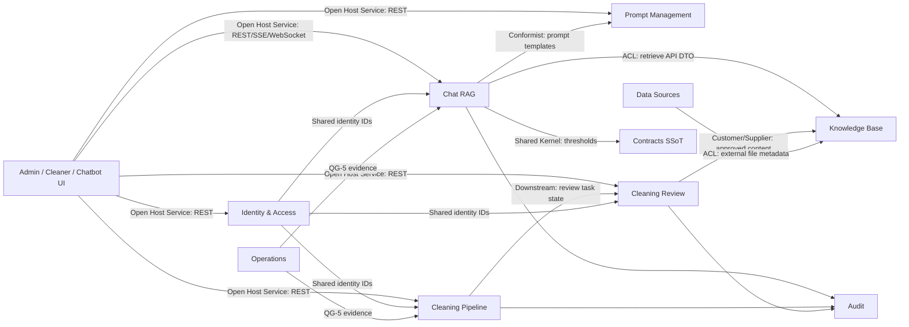

# Context Map

> Audience: human + AI. This document maps bounded contexts, ownership, relationships, and anti-corruption boundaries for ODA Cyber Konsult.

## Bounded Contexts

| Context | Owns | Primary Code | Primary Docs | Boundary Notes |
|---------|------|--------------|--------------|----------------|
| Identity & Access | Users, roles, password policy, JWT, token version, password history | `apps/api/src/modules/auth`, `apps/api/src/modules/users`, `apps/api/prisma/schema.prisma` | `PRD.md` Epic 1, `SRS_TECHNICAL.md` §4, `threat-model.md` | All actor identity must come from JWT/current user, not request body. |
| Chat RAG | Conversations, messages, mode config, context building, LLM generation, feedback, confidence | `apps/api/src/modules/chat`, `apps/api/src/modules/llm`, `apps/api/src/modules/websearch`, `python/rag-service/src/rag_service/retrieval` | `RTM.md` FR-02/16/22/23 | NestJS owns orchestration and user authorization; FastAPI owns retrieval. |
| Prompt Management | Prompt templates, role/mode prompt selection, variable rendering | `apps/api/src/modules/prompts`, `apps/admin/src/pages/PromptsPage.tsx` | `PRD.md` Epic 3, `SRS_TECHNICAL.md` §5.3 | Prompt renderer must stay equivalent between test API and production chat path. |
| Cleaning Pipeline | Upload, parse, detect PII, anonymize, task/file persistence | `apps/api/src/modules/cleaning`, `python/data-pipeline`, `python/rag-service/src/rag_service/api/v1/upload.py`, `clean.py`, `tasks.py` | `RTM.md` FR-04/05/08/09, `api/cleaning-api.md` | NestJS is proxy/gateway; Python owns processing and task state. |
| Cleaning Review | File review, tagging, content edit, submit, approve/reject, ingest | `apps/api/src/modules/cleaning/controllers/review.controller.ts`, `python/rag-service/src/rag_service/api/v1/review.py`, `apps/cleaner/src` | `RTM.md` FR-18, `architecture/data-cleaning-workflow.md` | Maker-Checker invariant is enforced in service/API layer. |
| Knowledge Base | Ingested documents, source metadata, Qdrant/BM25 indexes | `python/rag-service/src/rag_service/indexing`, `api/v1/knowledge_base.py`, `ingest.py` | `RTM.md` FR-17/20/21 | Retrieval model is not exposed directly to UI. |
| Audit | Audit events, resource metadata, export/query | `apps/api/src/modules/audit`, `apps/api/src/common/interceptors`, `python/rag-service/src/rag_service/db/models.py` | `RTM.md` FR-07, `api/audit-users-api.md` | Compliance-level audit requirements must be explicit before treating logs as complete traceability. |
| Data Sources | Google Drive config, sync, source file tracking | `apps/api/src/modules/datasources`, `python/rag-service/src/rag_service/api/v1/gdrive.py` | `api/gdrive-api.md`, `03-operations/gdrive-setup.md` | External provider model is translated before entering knowledge-base context. |
| Operations | Dev environment, deployment, backup/restore, DR, QG-5 readiness | `scripts/`, `docker-compose*.yml`, `docs/03-operations/` | `03-operations/runbook.md`, `qg5-readiness.md` | Production readiness is gated by QG-5, not by local dev success. |
| Contracts SSoT | Cross-language thresholds and enums | `contracts/*.yml`, `packages/contracts`, `python/shared/contracts.py` | `../contracts/README.md`, `RTM.md` v1.6.0 | Only values meeting cross-language/cross-file criteria belong here. |

## Context Relationships

## Integration Rules

- UI contexts must call NestJS only; browser clients must not call FastAPI directly.
- NestJS to FastAPI calls must carry `X-Internal-Token` and use DTO translation at the proxy boundary.
- Chat RAG must perform object-level authorization on conversation/message IDs before reading history or writing messages.
- Cleaning Review must derive submitter/reviewer/approver/ingester from JWT-injected actor identity.
- Contracts SSoT values are read by loaders; feature code must not duplicate those values as magic numbers.
- Python and NestJS may share PostgreSQL, but ownership remains split: Prisma owns NestJS tables; SQLAlchemy/Alembic owns cleaning/RAG tables.

## Aggregate Boundaries

| Aggregate Root | Children / Related Entities | Invariant |
|----------------|-----------------------------|-----------|
| User | PasswordHistory, AuditLog, Conversation | Disabled users cannot authenticate; credential rotation increments token version where required. |
| Conversation | Message | A conversation belongs to one user; all reads/writes require owner check except explicit admin audit views. |
| PromptTemplate | Variables | Role/mode and renderer behavior must remain consistent between test and production paths. |
| CleaningTask | TaskFile | Review status transitions must follow pending/rejected → review_requested → approved → ingested. |
| UploadedFile | TaskFile references | File metadata and content path must remain consistent through cleaning and review. |
| GoldenTestSet | TestRun, TestResult, GoldenTestThreshold | Evaluation thresholds must be traceable to baseline/manual/fallback source. |

## Anti-Corruption Layers

| Boundary | ACL / Translator | Purpose |
|----------|------------------|---------|
| NestJS → FastAPI Cleaning | `CleaningProxyService` and cleaning controllers | Preserve NestJS auth/RBAC while forwarding to Python APIs. |
| Chat → RAG Retrieve | `RagProxyService` | Convert chat needs into retrieval request/response DTOs. |
| External LLM Providers | `LlmService`, Gemini/OpenAI providers | Hide provider-specific payload and error handling from chat orchestration. |
| Google Drive → Knowledge Base | datasource controllers and FastAPI gdrive API | Translate provider file metadata into internal source records. |
| contracts.yml → Runtime | `packages/contracts`, `python/shared/contracts.py` | Validate and freeze shared values before runtime use. |
