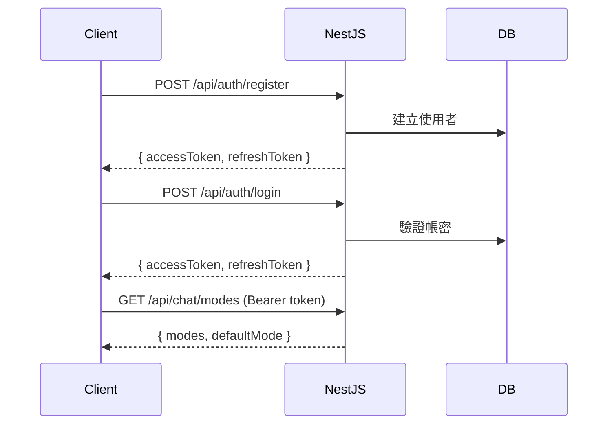
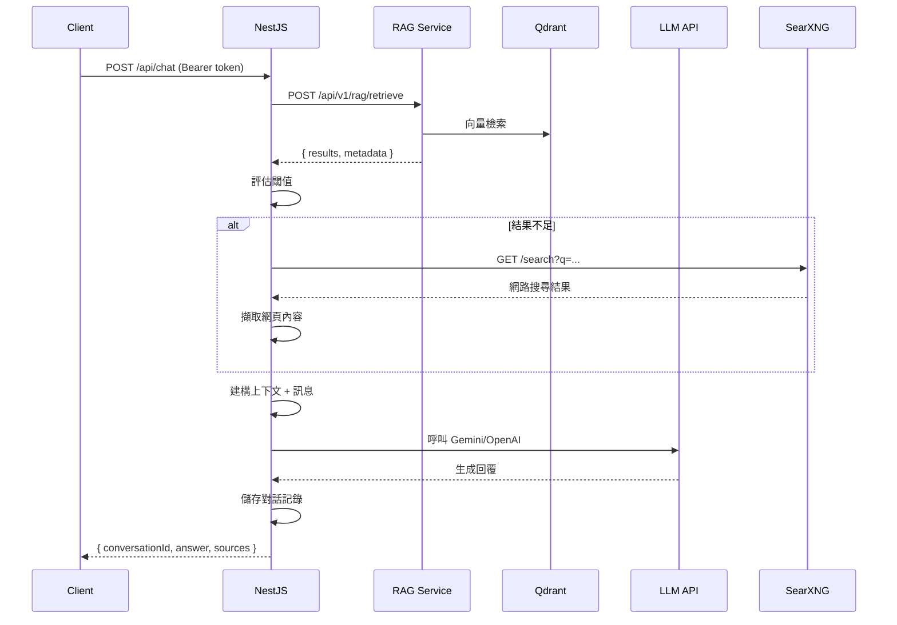
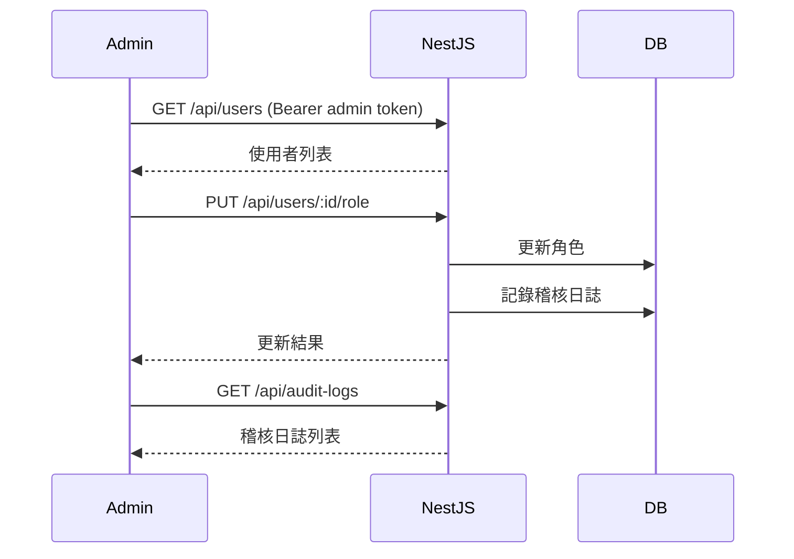

# API 文件

本目錄包含 ODA Cyber Konsult 專案的完整 API 文件。

## 文件索引

### NestJS API (Port 4000)

NestJS 後端提供以下核心功能：

| 文件 | 說明 | 路徑前綴 |
|------|------|----------|
| [health-api.md](./health-api.md) | 健康檢查端點 | `/health` |
| [auth-api.md](./auth-api.md) | 認證與授權 | `/api/auth` |
| [chat-api.md](./chat-api.md) | 聊天與對話管理 | `/api/chat` |
| [audit-users-api.md](./audit-users-api.md) | 使用者管理（Admin） | `/api/users` |
| [prompts-api.md](./prompts-api.md) | 提示詞管理（Admin） | `/api/prompts` |
| [cleaning-proxy.md](./cleaning-proxy.md) | 資料清洗代理 | `/api/v1/*` |
| [review-api.md](./review-api.md) | 審核工作流（審核/標籤/匯入 RAG） | `/api/v1/review/*` |
| [analytics-api.md](./analytics-api.md) | 資料分析統計 | `/api/v1/analytics/*` |
| [gdrive-api.md](./gdrive-api.md) | Google Drive 資料來源 | `/api/datasources/gdrive/*` |
| [websearch-api.md](./websearch-api.md) | 網路搜尋設定與 RAG Retrieve | `/api/websearch/*` |

### RAG Service API (Port 8000)

Python FastAPI 提供 RAG（檢索增強生成）相關功能：

| 文件 | 說明 | 路徑前綴 |
|------|------|----------|
| [rag-api.md](./rag-api.md) | RAG 查詢與文件管理 | `/api/v1/rag` |
| [cleaning-api.md](./cleaning-api.md) | 資料去識別化處理 | `/api/v1/*` |
| [data-pipeline-loaders-api.md](./data-pipeline-loaders-api.md) | 文件解析器 API | `data_pipeline.loaders` |

## 快速導覽

### 認證流程



### 聊天流程



### Admin 管理流程



## 通用規範

### 認證方式

所有需要認證的端點使用 JWT Bearer Token：

```http
Authorization: Bearer <accessToken>
```

### 回應格式

所有 API 回應遵循統一格式：

**成功回應**：
```json
{
  "success": true,
  "data": { ... },
  "timestamp": "2026-02-11T10:30:00.000Z"
}
```

**錯誤回應**：
```json
{
  "success": false,
  "error": {
    "code": "ERROR_CODE",
    "message": "錯誤訊息",
    "details": { ... }
  },
  "timestamp": "2026-02-11T10:30:00.000Z"
}
```

### HTTP 狀態碼

| 狀態碼 | 說明 | 使用場景 |
|--------|------|----------|
| 200 | OK | GET/PUT/PATCH 成功 |
| 201 | Created | POST 建立成功 |
| 204 | No Content | DELETE 成功 |
| 400 | Bad Request | 請求參數錯誤 |
| 401 | Unauthorized | 未授權（token 無效/過期） |
| 403 | Forbidden | 權限不足 |
| 404 | Not Found | 資源不存在 |
| 409 | Conflict | 資源衝突（如重複建立） |
| 500 | Internal Server Error | 伺服器錯誤 |

### 分頁參數

列表查詢支援分頁：

| 參數 | 類型 | 預設值 | 說明 |
|------|------|--------|------|
| `limit` | number | 20 | 每頁筆數 |
| `offset` | number | 0 | 起始位置 |

**回應格式**：
```json
{
  "items": [...],
  "total": 100,
  "limit": 20,
  "offset": 0
}
```

### 角色權限

| 角色 | 權限 |
|------|------|
| `user` | 基本聊天功能（beginner/standard 模式） |
| `it_user` | IT 進階功能 |
| `consultant` | 顧問模式（beginner/standard/expert） |
| `admin` | 完整系統管理權限 |

## 測試工具

### E2E 測試

專案已建立完整的 E2E 測試套件，涵蓋所有核心流程：

```bash
# 執行 E2E 測試
cd apps/api
pnpm test:e2e
```

詳細說明請參考：`apps/api/test/README.md`

### Swagger UI

NestJS API 提供 Swagger UI 介面（開發中）：

```
http://localhost:4000/api/docs
```

### 手動測試範例

使用 `curl` 測試：

```bash
# 1. 註冊使用者
curl -X POST http://localhost:4000/api/auth/register \
  -H "Content-Type: application/json" \
  -d '{"email":"test@example.com","password":"Test123456","name":"Test User"}'

# 2. 登入取得 token
TOKEN=$(curl -X POST http://localhost:4000/api/auth/login \
  -H "Content-Type: application/json" \
  -d '{"email":"test@example.com","password":"Test123456"}' \
  | jq -r '.data.accessToken')

# 3. 取得可用模式
curl http://localhost:4000/api/chat/modes \
  -H "Authorization: Bearer $TOKEN"

# 4. 發送聊天訊息
curl -X POST http://localhost:4000/api/chat \
  -H "Authorization: Bearer $TOKEN" \
  -H "Content-Type: application/json" \
  -d '{"question":"什麼是資安風險評估？","mode":"standard"}'
```

## 版本控制

API 版本管理策略：

- NestJS API：路徑前綴 `/api/` (當前版本)
- RAG Service：路徑前綴 `/api/v1/` (版本 1)

## 變更紀錄

- **2026-02-13**：LLM 生成遷移至 NestJS、新增 SearXNG 網路搜尋整合、新增 WebSearch Config API
- **2026-02-11**：新增審核工作流 API 與資料分析 API 文件
- **2026-02-11**：新增 Google Drive DataSource API 文件
- **2026-02-11**：建立完整 API 文件索引與規範
- **2026-02-09**：新增 NestJS 核心模組（Auth/Chat/Users/Audit/Prompts）
- **2026-02-07**：完成 RAG Service API 實作
- **2026-02-05**：建立 Cleaning API 基礎功能

## 聯絡資訊

如有 API 相關問題或建議，請透過專案 Issue 提出。
