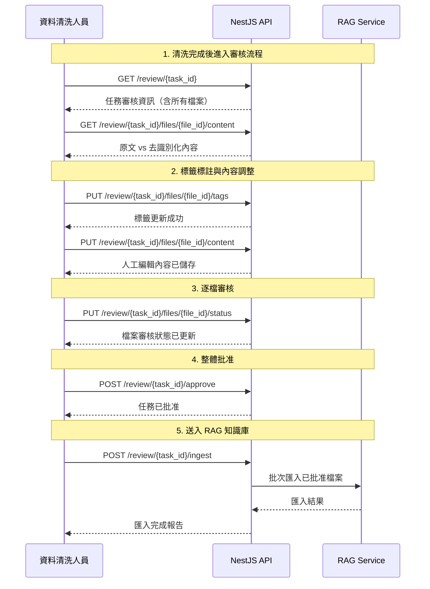

# 審核工作流 API 文件

> **版本**: v1
> **基礎路徑**: `/api/v1/review`
> **服務**: NestJS API (Port 4000) → FastAPI (Port 8000)
>
> **使用範圍**：本 API 僅供系統管理員與資料清洗人員使用，負責管理清洗任務的審核、標籤標註、人工編輯及 RAG 知識庫匯入流程。

## 目錄

- [通用說明](#通用說明)
- [工作流程](#工作流程)
- [端點列表](#端點列表)
- [任務審核資訊](#任務審核資訊)
- [檔案內容操作](#檔案內容操作)
- [標籤管理](#標籤管理)
- [檔案審核](#檔案審核)
- [任務批准](#任務批准)
- [RAG 知識庫匯入](#rag-知識庫匯入)
- [標籤自動完成](#標籤自動完成)
- [狀態值定義](#狀態值定義)
- [共用型別定義](#共用型別定義)

---

## 通用說明

### Base URL

```
http://localhost:4000/api/v1
```

### 認證方式

所有端點皆需 JWT Bearer Token，於 HTTP Header 中帶入：

```http
Authorization: Bearer <accessToken>
```

### 允許角色

| 角色 | 說明 |
|------|------|
| `admin` | 系統管理員，具備完整審核與匯入權限 |
| `data_cleaner` | 資料清洗人員，具備審核與標註權限 |

### 回應格式

所有 REST API 回應均使用 `ApiResponse<T>` 包裝：

```json
{
  "success": true,
  "data": { ... },
  "timestamp": "2026-02-11T10:30:00.000Z"
}
```

### 錯誤回應

```json
{
  "success": false,
  "error": {
    "code": "REVIEW_NOT_FOUND",
    "message": "找不到指定的任務審核資訊"
  },
  "timestamp": "2026-02-11T10:30:00.000Z"
}
```

### 常見 HTTP 狀態碼

| 狀態碼 | 說明 |
|--------|------|
| 200 | 請求成功 |
| 400 | 請求參數錯誤 |
| 401 | 未授權（token 無效或過期） |
| 403 | 權限不足 |
| 404 | 資源不存在 |
| 409 | 狀態衝突（如任務尚未完成即嘗試批准） |
| 422 | 資料驗證失敗 |
| 500 | 伺服器內部錯誤 |

---

## 工作流程

審核工作流的完整流程如下：

```
清洗完成 → 查看預覽 → 標籤標註 → 內容調整 → 確認批准 → 送入 RAG
```

### 流程說明



---

## 端點列表

| 方法 | 路徑 | 說明 | 需驗證 |
|------|------|------|--------|
| GET | `/api/v1/review/{task_id}` | 取得任務審核資訊 | 是 |
| GET | `/api/v1/review/{task_id}/files/{file_id}/content` | 取得檔案內容（原文 vs 去識別化） | 是 |
| PUT | `/api/v1/review/{task_id}/files/{file_id}/content` | 更新人工編輯內容 | 是 |
| PUT | `/api/v1/review/{task_id}/files/{file_id}/tags` | 更新檔案標籤 | 是 |
| PUT | `/api/v1/review/{task_id}/files/{file_id}/status` | 審核檔案（批准/退回） | 是 |
| POST | `/api/v1/review/{task_id}/approve` | 批准整個任務 | 是 |
| POST | `/api/v1/review/{task_id}/ingest` | 將已批准任務送入 RAG 知識庫 | 是 |
| GET | `/api/v1/review/tags` | 取得所有標籤（autocomplete 用） | 是 |

---

## 任務審核資訊

### 取得任務審核資訊

取得指定清洗任務的完整審核資訊，包含任務狀態、審批狀態、所有檔案的審核進度與標籤。

- **方法**: `GET`
- **路徑**: `/api/v1/review/{task_id}`
- **路徑參數**: `task_id` (UUID) - 任務唯一識別碼

#### 回應結構 - `TaskReviewResponse`

| 欄位 | 型別 | 說明 |
|------|------|------|
| `task_id` | `UUID` | 任務唯一識別碼 |
| `status` | `string` | 清洗任務狀態（`pending` / `processing` / `completed` / `failed` / `cancelled`） |
| `progress` | `float` | 清洗進度百分比（0-100） |
| `approval_status` | `string` | 審批狀態（`pending_review` / `approved` / `rejected`） |
| `files_total` | `int` | 檔案總數 |
| `files_processed` | `int` | 已完成清洗的檔案數 |
| `total_entities_found` | `int` | 所有檔案偵測到的實體總數 |
| `approved_by` | `string \| null` | 批准者名稱 |
| `approved_at` | `ISO 8601 \| null` | 批准時間 |
| `ingested_at` | `ISO 8601 \| null` | RAG 匯入時間 |
| `ingest_result` | `IngestResult \| null` | RAG 匯入結果摘要 |
| `created_at` | `ISO 8601` | 任務建立時間 |
| `completed_at` | `ISO 8601 \| null` | 清洗完成時間 |
| `files` | `FileReviewDetail[]` | 各檔案審核詳情 |

#### `FileReviewDetail` 結構

| 欄位 | 型別 | 說明 |
|------|------|------|
| `file_id` | `UUID` | 檔案唯一識別碼 |
| `filename` | `string` | 原始檔案名稱 |
| `status` | `string` | 清洗處理狀態（`completed` / `failed`） |
| `entity_count` | `int` | 該檔案偵測到的實體數 |
| `review_status` | `string` | 審核狀態（`pending` / `approved` / `rejected`） |
| `tags` | `string[]` | 檔案標籤列表 |
| `reviewed_by` | `string \| null` | 審核者名稱 |
| `reviewed_at` | `ISO 8601 \| null` | 審核時間 |
| `review_note` | `string \| null` | 審核備註 |

#### `IngestResult` 結構

| 欄位 | 型別 | 說明 |
|------|------|------|
| `files_processed` | `int` | 已匯入檔案數 |
| `chunks_added` | `int` | 新增的 Chunk 數 |
| `chunks_skipped` | `int` | 略過的 Chunk 數（重複） |

#### 回應範例

```json
{
  "success": true,
  "data": {
    "task_id": "c3d4e5f6-a7b8-9012-cdef-123456789012",
    "status": "completed",
    "progress": 100.0,
    "approval_status": "pending_review",
    "files_total": 3,
    "files_processed": 3,
    "total_entities_found": 47,
    "approved_by": null,
    "approved_at": null,
    "ingested_at": null,
    "ingest_result": null,
    "created_at": "2026-02-10T10:30:00.000Z",
    "completed_at": "2026-02-10T10:32:15.000Z",
    "files": [
      {
        "file_id": "a1b2c3d4-e5f6-7890-abcd-ef1234567890",
        "filename": "Q1_財務報告.pdf",
        "status": "completed",
        "entity_count": 32,
        "review_status": "approved",
        "tags": ["財務", "2026-Q1"],
        "reviewed_by": "admin@example.com",
        "reviewed_at": "2026-02-10T11:00:00.000Z",
        "review_note": "已確認去識別化結果正確"
      },
      {
        "file_id": "b2c3d4e5-f6a7-8901-bcde-f12345678901",
        "filename": "客戶清單.xlsx",
        "status": "completed",
        "entity_count": 15,
        "review_status": "pending",
        "tags": [],
        "reviewed_by": null,
        "reviewed_at": null,
        "review_note": null
      },
      {
        "file_id": "d4e5f6a7-b8c9-0123-defa-234567890123",
        "filename": "會議紀錄.docx",
        "status": "failed",
        "entity_count": 0,
        "review_status": "rejected",
        "tags": [],
        "reviewed_by": "admin@example.com",
        "reviewed_at": "2026-02-10T11:05:00.000Z",
        "review_note": "檔案解析失敗，需重新上傳"
      }
    ]
  }
}
```

#### curl 範例

```bash
curl http://localhost:4000/api/v1/review/c3d4e5f6-a7b8-9012-cdef-123456789012 \
  -H "Authorization: Bearer <accessToken>"
```

---

## 檔案內容操作

### 取得檔案內容（原文 vs 去識別化）

取得指定檔案的原始內容與去識別化後的內容，用於人工審核比對。支援顯示偵測到的實體標記位置。

- **方法**: `GET`
- **路徑**: `/api/v1/review/{task_id}/files/{file_id}/content`
- **路徑參數**:
  - `task_id` (UUID) - 任務唯一識別碼
  - `file_id` (UUID) - 檔案唯一識別碼

#### 回應結構 - `FileContentResponse`

| 欄位 | 型別 | 說明 |
|------|------|------|
| `file_id` | `UUID` | 檔案唯一識別碼 |
| `filename` | `string` | 原始檔案名稱 |
| `original_content` | `string` | 原始文字內容 |
| `cleaned_content` | `string` | 去識別化後的文字內容 |
| `edited_content` | `string \| null` | 人工編輯後的內容（尚未編輯時為 null） |
| `entities` | `DetectedEntity[]` | 偵測到的實體列表 |
| `tags` | `string[]` | 檔案標籤列表 |
| `review_status` | `string` | 審核狀態（`pending` / `approved` / `rejected`） |
| `review_note` | `string \| null` | 審核備註 |

#### `DetectedEntity` 結構

| 欄位 | 型別 | 說明 |
|------|------|------|
| `entity_type` | `string` | 實體類型（如 `PERSON`、`TW_ID`） |
| `text` | `string` | 原始文字片段 |
| `start` | `int` | 起始位置（字元偏移量） |
| `end` | `int` | 結束位置（字元偏移量） |
| `score` | `float` | 辨識信心分數（0-1） |
| `replacement` | `string` | 去識別化後的替換文字 |

#### 回應範例

```json
{
  "success": true,
  "data": {
    "file_id": "a1b2c3d4-e5f6-7890-abcd-ef1234567890",
    "filename": "Q1_財務報告.pdf",
    "original_content": "客戶王小明（身分證 A123456789）於 2026-01-10 來電反映帳戶問題，聯絡電話 0912-345-678，電子郵件 wang@example.com。",
    "cleaned_content": "客戶陳大華（身分證 **********）於 <DATE_TIME> 來電反映帳戶問題，聯絡電話 0912***678，電子郵件 ***@example.com。",
    "edited_content": null,
    "entities": [
      {
        "entity_type": "PERSON",
        "text": "王小明",
        "start": 2,
        "end": 5,
        "score": 0.95,
        "replacement": "陳大華"
      },
      {
        "entity_type": "TW_ID",
        "text": "A123456789",
        "start": 11,
        "end": 21,
        "score": 0.99,
        "replacement": "**********"
      },
      {
        "entity_type": "DATE_TIME",
        "text": "2026-01-10",
        "start": 24,
        "end": 34,
        "score": 0.92,
        "replacement": "<DATE_TIME>"
      },
      {
        "entity_type": "TW_PHONE",
        "text": "0912-345-678",
        "start": 48,
        "end": 60,
        "score": 0.97,
        "replacement": "0912***678"
      },
      {
        "entity_type": "EMAIL_ADDRESS",
        "text": "wang@example.com",
        "start": 66,
        "end": 82,
        "score": 0.98,
        "replacement": "***@example.com"
      }
    ],
    "tags": ["財務", "2026-Q1"],
    "review_status": "pending",
    "review_note": null
  }
}
```

#### curl 範例

```bash
curl http://localhost:4000/api/v1/review/c3d4e5f6-a7b8-9012-cdef-123456789012/files/a1b2c3d4-e5f6-7890-abcd-ef1234567890/content \
  -H "Authorization: Bearer <accessToken>"
```

---

### 更新人工編輯內容

當自動去識別化的結果不盡理想時，審核人員可手動編輯清洗後的內容。編輯後的內容將作為最終匯入 RAG 知識庫的版本。

- **方法**: `PUT`
- **路徑**: `/api/v1/review/{task_id}/files/{file_id}/content`
- **路徑參數**:
  - `task_id` (UUID) - 任務唯一識別碼
  - `file_id` (UUID) - 檔案唯一識別碼
- **Content-Type**: `application/json`

#### 請求結構

| 欄位 | 型別 | 必填 | 說明 |
|------|------|------|------|
| `edited_content` | `string` | 是 | 人工編輯後的文字內容 |

#### 請求範例

```json
{
  "edited_content": "客戶陳大華（身分證 **********）於去年來電反映帳戶問題，聯絡電話已遮蔽，電子郵件 ***@example.com。"
}
```

#### 回應結構

| 欄位 | 型別 | 說明 |
|------|------|------|
| `status` | `string` | 操作結果（`ok`） |
| `file_id` | `UUID` | 檔案唯一識別碼 |

#### 回應範例

```json
{
  "success": true,
  "data": {
    "status": "ok",
    "file_id": "a1b2c3d4-e5f6-7890-abcd-ef1234567890"
  }
}
```

#### curl 範例

```bash
curl -X PUT http://localhost:4000/api/v1/review/c3d4e5f6-a7b8-9012-cdef-123456789012/files/a1b2c3d4-e5f6-7890-abcd-ef1234567890/content \
  -H "Authorization: Bearer <accessToken>" \
  -H "Content-Type: application/json" \
  -d '{
    "edited_content": "客戶陳大華（身分證 **********）於去年來電反映帳戶問題，聯絡電話已遮蔽，電子郵件 ***@example.com。"
  }'
```

---

## 標籤管理

### 更新檔案標籤

為指定檔案設定或更新標籤。標籤用於分類管理，並可作為 RAG 知識庫匯入時的 metadata，供後續檢索過濾使用。

- **方法**: `PUT`
- **路徑**: `/api/v1/review/{task_id}/files/{file_id}/tags`
- **路徑參數**:
  - `task_id` (UUID) - 任務唯一識別碼
  - `file_id` (UUID) - 檔案唯一識別碼
- **Content-Type**: `application/json`

#### 請求結構

| 欄位 | 型別 | 必填 | 說明 |
|------|------|------|------|
| `tags` | `string[]` | 是 | 標籤列表（完整覆蓋，非增量更新） |

#### 請求範例

```json
{
  "tags": ["財務", "2026-Q1", "客戶資料"]
}
```

#### 回應結構

| 欄位 | 型別 | 說明 |
|------|------|------|
| `status` | `string` | 操作結果（`ok`） |
| `file_id` | `UUID` | 檔案唯一識別碼 |
| `tags` | `string[]` | 更新後的標籤列表 |

#### 回應範例

```json
{
  "success": true,
  "data": {
    "status": "ok",
    "file_id": "a1b2c3d4-e5f6-7890-abcd-ef1234567890",
    "tags": ["財務", "2026-Q1", "客戶資料"]
  }
}
```

#### curl 範例

```bash
curl -X PUT http://localhost:4000/api/v1/review/c3d4e5f6-a7b8-9012-cdef-123456789012/files/a1b2c3d4-e5f6-7890-abcd-ef1234567890/tags \
  -H "Authorization: Bearer <accessToken>" \
  -H "Content-Type: application/json" \
  -d '{ "tags": ["財務", "2026-Q1", "客戶資料"] }'
```

---

## 檔案審核

### 審核檔案（批准/退回）

針對單一檔案進行審核，決定是否批准（進入 RAG 知識庫）或退回（排除於匯入清單外）。

- **方法**: `PUT`
- **路徑**: `/api/v1/review/{task_id}/files/{file_id}/status`
- **路徑參數**:
  - `task_id` (UUID) - 任務唯一識別碼
  - `file_id` (UUID) - 檔案唯一識別碼
- **Content-Type**: `application/json`

#### 請求結構

| 欄位 | 型別 | 必填 | 說明 |
|------|------|------|------|
| `status` | `string` | 是 | 審核結果（`approved` 或 `rejected`） |
| `note` | `string` | 否 | 審核備註說明 |

#### 請求範例 - 批准

```json
{
  "status": "approved",
  "note": "去識別化結果正確，內容品質良好"
}
```

#### 請求範例 - 退回

```json
{
  "status": "rejected",
  "note": "仍有未偵測到的身分證字號，需調整規則後重新處理"
}
```

#### 回應結構

| 欄位 | 型別 | 說明 |
|------|------|------|
| `status` | `string` | 操作結果（`ok`） |
| `file_id` | `UUID` | 檔案唯一識別碼 |
| `review_status` | `string` | 更新後的審核狀態 |

#### 回應範例

```json
{
  "success": true,
  "data": {
    "status": "ok",
    "file_id": "a1b2c3d4-e5f6-7890-abcd-ef1234567890",
    "review_status": "approved"
  }
}
```

#### curl 範例

```bash
curl -X PUT http://localhost:4000/api/v1/review/c3d4e5f6-a7b8-9012-cdef-123456789012/files/a1b2c3d4-e5f6-7890-abcd-ef1234567890/status \
  -H "Authorization: Bearer <accessToken>" \
  -H "Content-Type: application/json" \
  -d '{ "status": "approved", "note": "去識別化結果正確" }'
```

---

## 任務批准

### 批准整個任務

將整個清洗任務標記為已批准。執行此操作前，所有檔案必須已完成個別審核（approved 或 rejected），且至少有一個檔案為 approved 狀態。

- **方法**: `POST`
- **路徑**: `/api/v1/review/{task_id}/approve`
- **路徑參數**: `task_id` (UUID) - 任務唯一識別碼
- **Content-Type**: `application/json`

#### 前置條件

| 條件 | 說明 |
|------|------|
| 任務狀態 | `status` 必須為 `completed`（清洗已完成） |
| 檔案審核 | 所有檔案的 `review_status` 必須為 `approved` 或 `rejected`（不得有 `pending`） |
| 批准檔案 | 至少 1 個檔案為 `approved` 狀態 |

#### 請求結構

| 欄位 | 型別 | 必填 | 說明 |
|------|------|------|------|
| `note` | `string` | 否 | 批准備註 |

#### 請求範例

```json
{
  "note": "所有檔案審核完畢，準備匯入知識庫"
}
```

#### 回應結構

| 欄位 | 型別 | 說明 |
|------|------|------|
| `status` | `string` | 操作結果（`ok`） |
| `task_id` | `UUID` | 任務唯一識別碼 |
| `approval_status` | `string` | 審批狀態（`approved`） |
| `approved_files` | `int` | 已批准的檔案數 |
| `rejected_files` | `int` | 被退回的檔案數 |

#### 回應範例

```json
{
  "success": true,
  "data": {
    "status": "ok",
    "task_id": "c3d4e5f6-a7b8-9012-cdef-123456789012",
    "approval_status": "approved",
    "approved_files": 2,
    "rejected_files": 1
  }
}
```

#### 錯誤回應範例 - 尚有未審核檔案

```json
{
  "success": false,
  "error": {
    "code": "REVIEW_INCOMPLETE",
    "message": "尚有 1 個檔案未完成審核，無法批准整個任務"
  },
  "timestamp": "2026-02-11T10:30:00.000Z"
}
```

#### 錯誤回應範例 - 任務未完成

```json
{
  "success": false,
  "error": {
    "code": "TASK_NOT_COMPLETED",
    "message": "任務狀態為 processing，需等待清洗完成後才能批准"
  },
  "timestamp": "2026-02-11T10:30:00.000Z"
}
```

#### 錯誤回應範例 - 無任何已批准檔案

```json
{
  "success": false,
  "error": {
    "code": "NO_APPROVED_FILES",
    "message": "至少需要 1 個已批准檔案才能批准整個任務"
  },
  "timestamp": "2026-02-11T10:30:00.000Z"
}
```

#### curl 範例

```bash
curl -X POST http://localhost:4000/api/v1/review/c3d4e5f6-a7b8-9012-cdef-123456789012/approve \
  -H "Authorization: Bearer <accessToken>" \
  -H "Content-Type: application/json" \
  -d '{ "note": "所有檔案審核完畢，準備匯入知識庫" }'
```

---

## RAG 知識庫匯入

### 將已批准任務送入 RAG 知識庫

將已批准任務中所有 `approved` 狀態的檔案送入 RAG 知識庫進行向量化處理。若檔案有 `edited_content`，將優先使用人工編輯版本；否則使用自動去識別化版本。

- **方法**: `POST`
- **路徑**: `/api/v1/review/{task_id}/ingest`
- **路徑參數**: `task_id` (UUID) - 任務唯一識別碼
- **Content-Type**: `application/json`

#### 前置條件

| 條件 | 說明 |
|------|------|
| 審批狀態 | `approval_status` 必須為 `approved` |
| 尚未匯入 | `ingested_at` 必須為 `null`（不可重複匯入） |

#### 請求結構

| 欄位 | 型別 | 必填 | 說明 |
|------|------|------|------|
| `tags` | `string[]` | 否 | 額外附加至所有匯入檔案的全域標籤 |
| `hierarchical` | `boolean` | 否 | 是否啟用階層式切分（Parent/Child Chunks），預設 `false` |

#### 請求範例

```json
{
  "tags": ["已審核", "2026-Q1"],
  "hierarchical": true
}
```

#### 回應結構 - `IngestResponse`

| 欄位 | 型別 | 說明 |
|------|------|------|
| `task_id` | `UUID` | 任務唯一識別碼 |
| `files_processed` | `int` | 已處理的檔案數（僅含 approved） |
| `chunks_added` | `int` | 新增的向量 Chunk 數 |
| `chunks_skipped` | `int` | 略過的 Chunk 數（重複內容，以 UUID5 去重） |
| `errors` | `IngestError[]` | 匯入過程中的錯誤列表 |

#### `IngestError` 結構

| 欄位 | 型別 | 說明 |
|------|------|------|
| `file_id` | `UUID` | 發生錯誤的檔案 ID |
| `filename` | `string` | 檔案名稱 |
| `error` | `string` | 錯誤訊息 |

#### 回應範例 - 成功

```json
{
  "success": true,
  "data": {
    "task_id": "c3d4e5f6-a7b8-9012-cdef-123456789012",
    "files_processed": 2,
    "chunks_added": 45,
    "chunks_skipped": 3,
    "errors": []
  }
}
```

#### 回應範例 - 部分失敗

```json
{
  "success": true,
  "data": {
    "task_id": "c3d4e5f6-a7b8-9012-cdef-123456789012",
    "files_processed": 2,
    "chunks_added": 30,
    "chunks_skipped": 0,
    "errors": [
      {
        "file_id": "b2c3d4e5-f6a7-8901-bcde-f12345678901",
        "filename": "客戶清單.xlsx",
        "error": "文件切分失敗：內容為空"
      }
    ]
  }
}
```

#### 錯誤回應範例 - 尚未批准

```json
{
  "success": false,
  "error": {
    "code": "NOT_APPROVED",
    "message": "任務尚未批准，無法送入 RAG 知識庫"
  },
  "timestamp": "2026-02-11T10:30:00.000Z"
}
```

#### 錯誤回應範例 - 已經匯入

```json
{
  "success": false,
  "error": {
    "code": "ALREADY_INGESTED",
    "message": "此任務已於 2026-02-10T15:00:00.000Z 匯入知識庫，不可重複匯入"
  },
  "timestamp": "2026-02-11T10:30:00.000Z"
}
```

#### curl 範例

```bash
curl -X POST http://localhost:4000/api/v1/review/c3d4e5f6-a7b8-9012-cdef-123456789012/ingest \
  -H "Authorization: Bearer <accessToken>" \
  -H "Content-Type: application/json" \
  -d '{
    "tags": ["已審核", "2026-Q1"],
    "hierarchical": true
  }'
```

---

## 標籤自動完成

### 取得所有標籤

取得系統中已使用過的所有標籤列表，供前端 autocomplete 元件使用。回傳結果依使用頻率排序。

- **方法**: `GET`
- **路徑**: `/api/v1/review/tags`

#### 回應結構

| 欄位 | 型別 | 說明 |
|------|------|------|
| `tags` | `string[]` | 所有已使用的標籤列表 |

#### 回應範例

```json
{
  "success": true,
  "data": {
    "tags": [
      "財務",
      "客戶資料",
      "人事",
      "2026-Q1",
      "資安政策",
      "法規遵循",
      "已審核"
    ]
  }
}
```

#### curl 範例

```bash
curl http://localhost:4000/api/v1/review/tags \
  -H "Authorization: Bearer <accessToken>"
```

---

## 狀態值定義

### 任務清洗狀態（`status`）

| 值 | 說明 |
|------|------|
| `pending` | 等待處理 |
| `processing` | 清洗處理中 |
| `completed` | 清洗已完成 |
| `failed` | 清洗失敗 |
| `cancelled` | 已取消 |

### 任務審批狀態（`approval_status`）

| 值 | 說明 |
|------|------|
| `pending_review` | 等待審核（清洗完成後的初始狀態） |
| `approved` | 已批准（可送入 RAG 知識庫） |
| `rejected` | 已退回（所有檔案皆被退回時） |

### 檔案審核狀態（`review_status`）

| 值 | 說明 |
|------|------|
| `pending` | 等待審核 |
| `approved` | 已批准（將匯入 RAG 知識庫） |
| `rejected` | 已退回（排除於匯入清單外） |

---

## 共用型別定義

以下型別定義可納入 `packages/shared-types/` 中供前後端共用：

```typescript
// 任務審核回應
interface TaskReviewResponse {
  task_id: string;
  status: 'pending' | 'processing' | 'completed' | 'failed' | 'cancelled';
  progress: number;
  approval_status: 'pending_review' | 'approved' | 'rejected';
  files_total: number;
  files_processed: number;
  total_entities_found: number;
  approved_by: string | null;
  approved_at: string | null;
  ingested_at: string | null;
  ingest_result: IngestResult | null;
  created_at: string;
  completed_at: string | null;
  files: FileReviewDetail[];
}

// 檔案審核詳情
interface FileReviewDetail {
  file_id: string;
  filename: string;
  status: 'completed' | 'failed';
  entity_count: number;
  review_status: 'pending' | 'approved' | 'rejected';
  tags: string[];
  reviewed_by: string | null;
  reviewed_at: string | null;
  review_note: string | null;
}

// 檔案內容回應
interface FileContentResponse {
  file_id: string;
  filename: string;
  original_content: string;
  cleaned_content: string;
  edited_content: string | null;
  entities: DetectedEntity[];
  tags: string[];
  review_status: 'pending' | 'approved' | 'rejected';
  review_note: string | null;
}

// 偵測到的實體
interface DetectedEntity {
  entity_type: string;
  text: string;
  start: number;
  end: number;
  score: number;
  replacement: string;
}

// RAG 匯入回應
interface IngestResponse {
  task_id: string;
  files_processed: number;
  chunks_added: number;
  chunks_skipped: number;
  errors: IngestError[];
}

// 匯入錯誤
interface IngestError {
  file_id: string;
  filename: string;
  error: string;
}

// 匯入結果摘要
interface IngestResult {
  files_processed: number;
  chunks_added: number;
  chunks_skipped: number;
}

// 審核檔案請求
interface ReviewFileStatusRequest {
  status: 'approved' | 'rejected';
  note?: string;
}

// 更新標籤請求
interface UpdateTagsRequest {
  tags: string[];
}

// 更新編輯內容請求
interface UpdateEditedContentRequest {
  edited_content: string;
}

// 任務批准請求
interface ApproveTaskRequest {
  note?: string;
}

// 匯入請求
interface IngestRequest {
  tags?: string[];
  hierarchical?: boolean;
}
```
