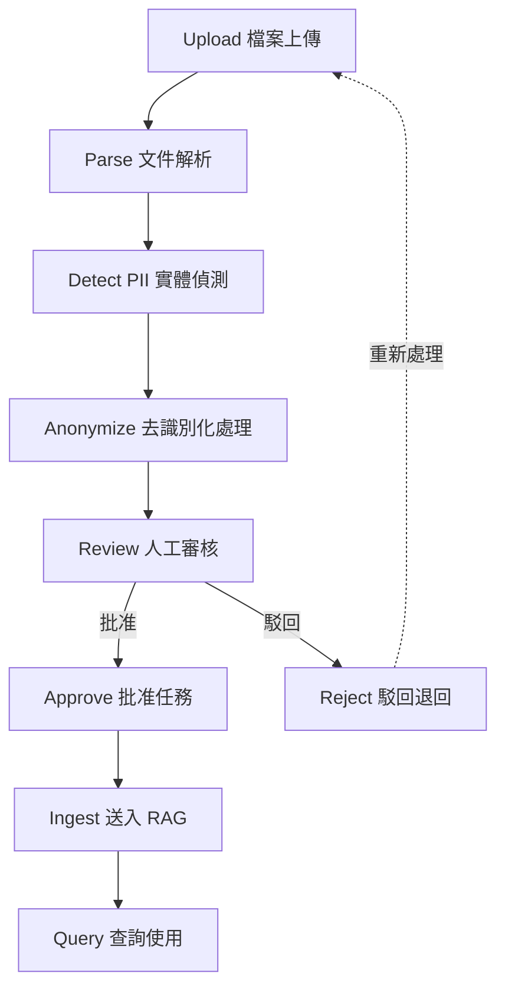

# 資料清洗工作流

## 完整資料流程



## 各階段說明

### 1. Upload（檔案上傳）

| 項目 | 說明 |
|------|------|
| **執行者** | 系統管理員 |
| **介面** | Admin Dashboard |
| **系統元件** | NestJS API → FastAPI Upload |
| **輸入** | PDF / DOCX / XLSX / CSV / TXT 等檔案 |
| **輸出** | 檔案記錄（files 表） |
| **API** | `POST /api/v1/upload` |

### 2. Parse（文件解析）

| 項目 | 說明 |
|------|------|
| **執行者** | 系統自動 |
| **系統元件** | data-pipeline ParserFactory |
| **支援格式** | PDF (pdfminer.six)、DOCX (python-docx)、XLSX (openpyxl)、CSV/TXT (直接讀取)、HTML (beautifulsoup4) |
| **輸出** | 純文字內容 |

### 3. Detect PII（實體偵測）

| 項目 | 說明 |
|------|------|
| **執行者** | 系統自動 |
| **系統元件** | Microsoft Presidio + spaCy NER |
| **偵測類型** | 19 種（含台灣專屬：身分證、手機、統一編號） |
| **輸出** | 實體位置、類型、信心分數 |

### 4. Anonymize（去識別化）

| 項目 | 說明 |
|------|------|
| **執行者** | 系統自動（依規則設定檔） |
| **系統元件** | Presidio Anonymizer |
| **策略** | mask / partial_mask / pseudonymize / generalize / keep_labeled / encrypt |
| **輸出** | 去識別化後的文件 + JSON 清洗報告 |
| **API** | `POST /api/v1/clean` |

### 5. Review（人工審核）

| 項目 | 說明 |
|------|------|
| **執行者** | 資料清洗人員 / 系統管理員 |
| **介面** | Cleaner App |
| **功能** | 內容對比檢視、手動編輯修正、標籤分類、逐檔審核 |
| **API** | `GET/PUT /api/v1/review/{task_id}/files/{file_id}/*` |

### 6. Approve / Reject（批准或駁回）

| 項目 | 說明 |
|------|------|
| **執行者** | 資料清洗人員 / 系統管理員 |
| **介面** | Cleaner App |
| **條件** | 所有檔案審核完成後方可批准 |
| **API** | `POST /api/v1/review/{task_id}/approve` |

### 7. Ingest（送入 RAG 知識庫）

| 項目 | 說明 |
|------|------|
| **執行者** | 系統管理員 |
| **介面** | Cleaner App |
| **系統元件** | QdrantStore + BM25Store |
| **處理** | 文件切分 → 向量化 → 儲存至 Qdrant |
| **API** | `POST /api/v1/review/{task_id}/ingest` |

### 8. Query（查詢使用）

| 項目 | 說明 |
|------|------|
| **執行者** | 所有角色 |
| **介面** | Chatbot UI |
| **系統元件** | RAG Service (Hybrid Search + LLM) |
| **API** | `POST /api/v1/rag/query` |

## 審核狀態機

```
                    清洗完成
                       │
                       ▼
               ┌──────────────┐
               │   pending    │ (待審核)
               └──────┬───────┘
                      │ 開始審核
                      ▼
               ┌──────────────┐
               │  reviewing   │ (審核中：查看/標籤/編輯)
               └──────┬───────┘
                      │
            ┌─────────┼─────────┐
            │                   │
            ▼                   ▼
    ┌──────────────┐    ┌──────────────┐
    │   approved   │    │   rejected   │
    │   (已批准)   │    │   (已駁回)   │
    └──────┬───────┘    └──────────────┘
           │ 送入 RAG
           ▼
    ┌──────────────┐
    │   ingested   │
    │   (已匯入)   │
    └──────────────┘
```

## 相關文件

| 文件 | 路徑 |
|------|------|
| 清洗 API 文件 | `docs/api/cleaning-api.md` |
| 知識庫 API 文件 | `docs/api/knowledge-base-api.md` |
| RAG API 文件 | `docs/api/rag-api.md` |
| 系統架構概述 | `docs/architecture/system-overview.md` |
